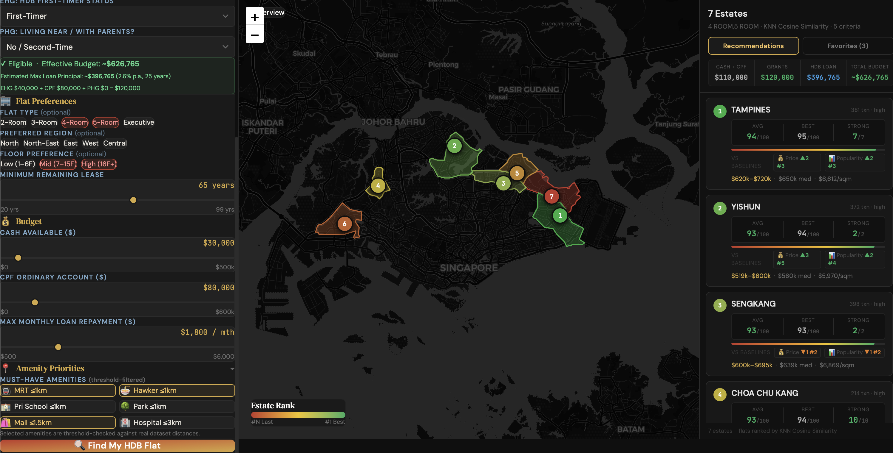

## SECTION 1 : PROJECT TITLE
## HDB Finder



---

## SECTION 2 : EXECUTIVE SUMMARY / PAPER ABSTRACT

Buying a first home in Singapore should be a milestone, yet it often becomes a tedious, bureaucratic process. With complicated HDB schemes and thousands of HDB resale flats on the market, finding the right estate and property - balancing lifestyle, location, and budget - remains a tiresome and time-consuming process. Currently, no single buyer-focused intelligent system exists to guide buyers through this fragmented landscape.

Our team set out to build **HDB Finder**, an AI-powered HDB recommender system that simplifies property hunting by integrating eligibility rules, HDB grants, property features, and lifestyle preferences into a single, intuitive platform. The system targets Singapore Citizens and Permanent Residents purchasing HDB resale flats, and covers grant eligibility (citizenship, income ceiling, flat ownership rules, HDB and loan schemes) as well as amenity proximity scoring across MRT stations, schools, hawker centres, parks, and hospitals.

The solution is built around a hybrid intelligent reasoning pipeline. A rule-based eligibility engine validates buyer profiles against current HDB policy constraints in real time, computing applicable grants (EHG, CPF Housing Grant, PHG) and an effective budget. A hybrid constraint-based and content-based filtering recommender system then scores and ranks individual resale flat listings using weighted cosine similarity between buyer preference vectors and per-flat feature vectors - covering floor preference, budget fit, and six amenity proximity dimensions - with Maximal Marginal Relevance (MMR) applied for diversity reranking to ensure estate variety in the Top-10 recommendations. To rigorously evaluate recommendation quality, the system conducts A/B testing across three model variants: Weighted Cosine Similarity + MMR, Euclidean Distance, and K-Nearest Neighbours (KNN), enabling objective comparison of ranking performance across different similarity metrics.

All data is sourced from publicly available and authorised datasets: HDB resale transaction records (Oct 2025–present) from data.gov.sg, geospatial amenity data for MRT stations, schools, hawker centres, parks, and hospitals via OneMap and data.gov.sg, and shopping mall data scraped from Wikipedia. The system is delivered as an interactive React web application with a Leaflet map interface, enabling users to visualise flat locations, nearby amenities, and transport links alongside ranked recommendations.

Our team had an enriching experience building this end-to-end AI system, and we hope it empowers first-time HDB buyers to make confident, well-informed housing decisions - reducing complexity at every step of the process.

---

## SECTION 3 : CREDITS / PROJECT CONTRIBUTION

| Official Full Name | Student ID (MTech Applicable) | Work Items (Who Did What) | Email (Optional) |
| :------------ |:---------------:| :-----| :-----|
| Loh Kian Chee (Group Lead) | A0339775J |  Project Ideation, Scope & Management; Frontend User Panel; Frontend App; Eligibility Engine; User Testings & Feedback Collection | kian.chee.loh@u.nus.edu |
| Udayakumar Nivetha | A0245895L | Backend Redis Setup; Euclidean Distance & KNN Cosine Similarity Recommender Models; Models Evaluation Code; User Favorite Tab + Button Functionality; Data Collection (Schools + Hospitals)  | e0908182@u.nus.edu |
| Sim Yee Fei | A0339751W | Frontend (React/Tailwind/Leaflet) UI/UX, 3-phase map drill-down; Frontend Backend data integration (flat-lookup & flat-amenities routes); Weighted Cosine Similarity + MMR Recommender Model; Parallel/cached amenity queries | yee-fei.sim@u.nus.edu |
| Lim Zheng Tao | A0339804X | Data Collection & Preparation; Amenities Relationships & Proximity Distance Conversion; UI/UX Enhancements | zhengtao.lim@u.nus.edu |

---

## SECTION 4 : VIDEO OF SYSTEM MODELLING & USE CASE DEMO

[](https://youtu.be/g_iaRn5MaV0 "HDB Finder")

---

## SECTION 5 : USER GUIDE

`Refer to appendix <Installation & User Guide> in project report at Github Folder: ProjectReport`

### Prerequisites

- [Node.js](https://nodejs.org/) v18 or later (npm included)
- [Python](https://www.python.org/) v3.14.2 
- [MySQL](https://dev.mysql.com/downloads/) v8.0 or later
- [Redis](https://redis.io/) v7 or later (macOS: `brew install redis`)

### [ 1 ] Database Setup

Download and import the pre-built MySQL database dump:

> Download MySQL dump from: https://drive.google.com/file/d/10XaZlv54KmUj2S-HaojwwqJawig5pG0E/view?usp=sharing

```bash
mysql -u root -p < SystemCode/db/iss-irs-ai-estate-recommender-08.sql
```

### [ 2 ] To run the system on macOS / Linux

```bash
cd SystemCode
chmod +x start-dev.sh
./start-dev.sh
```

The script automatically installs all dependencies, starts Redis and MySQL, and launches the backend and frontend.

**Go to URL using web browser:** http://localhost:5173

### [ 3 ] To run the system on Windows

```bat
cd SystemCode
start-dev.bat
```

**Go to URL using web browser:** http://localhost:5173

### [ 4 ] Service Ports

| Service | Port | Description |
|---------|------|-------------|
| Frontend (React/Vite) | 5173 | User-facing web application |
| Backend API (Node.js) | 3000 | REST API gateway |
| Redis | 6379 | Message queue and cache |
| MySQL | 3306 | Primary database |

---

## SECTION 6 : PROJECT REPORT / PAPER

`Refer to project report at Github Folder: ProjectReport`

**Recommended Sections for Project Report / Paper:**
- Executive Summary / Paper Abstract
- Business Problem Background
- Market Research
- Project Objectives & Success Measurements
- Project Solution (Domain modelling & system design)
- Project Implementation (System development & testing approach)
- Project Performance & Validation (Proof that project objectives are met)
- Project Conclusions: Findings & Recommendation
- Appendix of report: Project Proposal
- Appendix of report: Mapped System Functionalities against knowledge, techniques and skills of modular courses: MR, RS, CGS
- Appendix of report: Installation and User Guide
- Appendix of report: Individual project report per project member
- Appendix of report: List of Abbreviations (if applicable)
- Appendix of report: References (if applicable)

---

## SECTION 7 : MISCELLANEOUS

### System Architecture

The system follows a microservices architecture:

| Layer | Technology | Description |
|-------|-----------|-------------|
| Frontend | React 19, Vite, Tailwind CSS, Leaflet | Interactive web app with map view |
| Backend API | Node.js, Express, TypeScript | REST API gateway with Redis caching |
| Eligibility Checker Service | Python | Rule-based HDB policy engine |
| Budget Estimator Service | Python | Grant computation (EHG, CPF, PHG) and effective budget |
| Estate Finder Service | Python | Constraint-based flat filtering by region, flat type, budget |
| Recommendation Scorer Service | Python | Weighted Cosine Similarity + MMR, Euclidean Distance and KNN (A/B testing evaluation) |
| Amenity Proximity Service | Python | Geospatial distance computation to MRT, schools, hawker centres, parks, hospitals |
| Data Service | Python | Data ingestion pipeline from data.gov.sg APIs |
| Database | MySQL | Resale flat transactions, amenity data, user favourites |
| Cache / Queue | Redis | Adapter result caching and inter-service messaging |

### Data Sources

| Dataset | Source | Link |
|---------|--------|-------|
| Resale Flat Prices By HDB | data.gov.sg | `https://data.gov.sg/datasets?resultId=d_8b84c4ee58e3cfc0ece0d773c8ca6abc` |
| MRT Stations By LTA| data.gov.sg | `https://data.gov.sg/datasets?resultId=d_b39d3a0871985372d7e1637193335da5` |
| MRT Stations Lines By LTA| data.gov.sg | `https://data.gov.sg/datasets?resultId=d_d312a5b127e1ae74299b8ae664cedd4e` |
| Hawker Centres By NEA | data.gov.sg | `https://data.gov.sg/datasets?query=hawker+centres&resultId=d_4a086da0a5553be1d89383cd90d07ecd` |
| Public Sector Hospitals By MOH | data.gov.sg | `https://data.gov.sg/datasets?resultId=d_1338b55f6d4ea6b2df9884ec4bce4464` |
| Schools By MOE | data.gov.sg | `https://data.gov.sg/datasets?resultId=d_688b934f82c1059ed0a6993d2a829089` |
| Parks By NPARKS | data.gov.sg | `https://data.gov.sg/datasets?resultId=d_0542d48f0991541706b58059381a6eca` |
| Planning Area Boundaries By URA | data.gov.sg | `https://data.gov.sg/datasets?resultId=d_4765db0e87b9c86336792efe8a1f7a66` |
| Shopping Malls | Wikipedia | `https://en.wikipedia.org/wiki/List_of_shopping_malls_in_Singapore` |

### External Api Sources
| Source | Link |
|--------|------|
| OneMap Geolocation | `https://www.onemap.gov.sg/api/common/elastic/search`|
| Nominatim OpenStreetMap Geolocation | `https://nominatim.openstreetmap.org/search?q={{address}}&format=jsonv2`|

### Recommendation Scoring — Vector Design

Individual resale flats are scored using **weighted cosine similarity** between a buyer-preference vector and a per-flat vector across **7 dimensions**: floor preference, MRT proximity, hawker centre proximity, shopping mall proximity, park proximity, primary school proximity, and hospital proximity. **Maximal Marginal Relevance (MMR)** is applied as a diversity reranking step to balance relevance with variety in the Top-10 results.

Budget, flat type, and region are handled as **hard pre-filters** (not vector dimensions) because cosine similarity penalises deviation in both directions - cheaper flats or flats with more remaining lease should never be penalised.

To evaluate and compare recommender performance, the system implements **A/B testing** across three model variants:

| Model | Description |
|-------|-------------|
| Weighted Cosine Similarity + MMR | Preference-weighted angular similarity with diversity reranking |
| Euclidean Distance | Alternative metric — measures absolute feature-space distance between buyer and flat vectors |
| K-Nearest Neighbours (KNN) | Alternative model — retrieves top-k most similar flats based on nearest-neighbour search |

---
